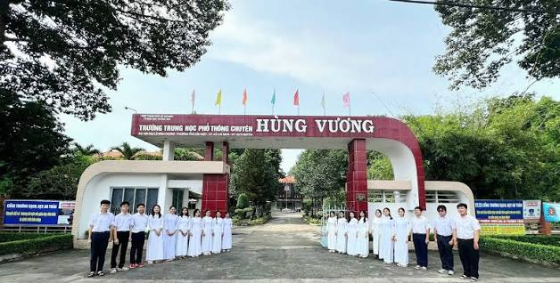

# MASTER PROMPT: THIẾT KẾ WEBSITE BÁO CÁO TOÀN DIỆN THPT CHUYÊN HÙNG VƯƠNG (1996–2026)
> **Yêu cầu đặc tả**: Chuyển đổi 100% dữ liệu từ File Báo cáo Word sang Website hiện đại (Single Page Application HTML5/TailwindCSS/JS hoặc React), đảm bảo **ĐẦY ĐỦ NỘI DUNG TUYỆT ĐỐI**, **HIỆU ỨNG CHUYỂN ĐỘNG SIÊU MƯỢT (SMOOTH ANIMATIONS)** và **GIỮ TRỌN VẸN VỊ TRÍ, Ý NGHĨA HÌNH ẢNH GỐC**.

---

## 1. VAI TRÒ VÀ MỤC TIÊU CỦA AI (ROLE & GOAL)
- **Role**: Bạn là một Chuyên gia Lập trình Web Frontend cao cấp (Creative Web Developer & UI/UX Designer) chuyên xây dựng các trang web kỷ yếu học đường, cổng thông tin điện tử giáo dục và dashboard số liệu tương tác.
- **Goal**: Xây dựng một trang web Single Page hoàn chỉnh (hoặc file `index.html` độc lập gồm đầy đủ HTML, CSS Tailwind/Custom CSS, JS) thể hiện trọn vẹn toàn bộ văn bản của **Báo cáo Giới thiệu Tổng quan và Định hướng Tuyển sinh — Trường THPT Chuyên Hùng Vương (30 năm phát triển 1996–2026)**.
- **Cam kết chất lượng cốt lõi**:
  1. **Bảo toàn 100% dữ liệu gốc**: Giữ nguyên toàn bộ 9 chương, mọi số văn bản, mọi mốc thời gian, toàn bộ bảng điểm chuẩn 3 năm (2024–2026), 7 thủ khoa/đồng thủ khoa các khối thi 2026, các hoạt động ngoại khóa, 8 tài liệu tham khảo và danh sách 6 thành viên Lớp 9A12. Không cắt xén, không viết tắt, không tóm lược làm mất dữ liệu.
  2. **Bảo tồn và tôn vinh hình ảnh gốc**: Đặt đúng vị trí 2 bức ảnh cốt lõi trong file Word với khung viền kính cường lực (Glassmorphism), hiệu ứng zoom nhẹ (Hover scale), caption rõ ràng và tính năng Lightbox phóng to xem ảnh nét.
  3. **Bộ hiệu ứng chuyển động cao cấp & âm thanh tương tác (Advanced Motion Suite & Audio FX)**:
     - **Hero Constellation Canvas**: Canvas hạt sao kết nối tương tác theo tọa độ chuột trên nền Hero xanh đêm.
     - **Hiệu ứng 3D Card Tilt Engine**: Nghiêng 3D đa chiều phản hồi theo vị trí con trỏ chuột trên các thẻ KPI, thẻ Thủ khoa danh dự và thẻ Thành viên Lớp 9A12.
     - **Dynamic Timeline Fill**: Dòng thời gian lịch sử tự động tăng trưởng chiều cao nối tiếp từ mốc 1995 đến 2026 khi cuộn trang, kích hoạt hiệu ứng vòng sáng (Pulse Ring) cho các điểm mốc.
     - **Web Audio API Synth**: Bộ tổng hợp âm thanh chuông thanh thoát cho phản hồi tương tác (khi trả lời minigame, click thẻ vinh danh, chuyển tab, bật/tắt âm thanh qua nút volume trên Navbar).
     - **Ambient Cursor Spotlight**: Đốm sáng tinh tế theo sát chuyển động chuột trên toàn bộ website.
     - **ScrollSpy Active Navbar**: Thanh điều hướng tự động gán đường viền gradient đa sắc tương ứng với chương đang xem.
     - **Bộ lọc tức thì (Live Table Filter)**: Hộp lọc nhanh môn chuyên theo thời gian thực trên các bảng điểm chuẩn.
     - **Celebration Confetti & Floating Toast**: Pháo hoa giấy rực rỡ và thông báo nổi khi vinh danh thủ khoa, thành viên hoặc chúc mừng 30 năm thành lập trường.

---

## 2. BỘ NHẬN DIỆN HÌNH ẢNH & THẨM MỸ (DESIGN SYSTEM)
- **Phong cách chủ đạo**: Modern Educational Glassmorphism kết hợp Flat Clean UI hiện đại, trang trọng, đậm chất học thuật tinh hoa.
- **Bảng mã màu chuẩn (Color Palette)**:
  - **Navy Blue (Xanh chủ đạo tri thức)**: `#0B2545` (Nền header, footer, dark sections)
  - **Royal Blue (Xanh thương hiệu)**: `#134074` / `#0077B6` (Nút bấm, điểm nhấn, thanh tiến trình)
  - **Academic Gold (Vàng ánh kim danh dự)**: `#EE9B00` / `#D4A373` (Huy hiệu, điểm 10, vinh danh thủ khoa)
  - **Soft Slate / Pearl White (Nền nội dung dịu mắt)**: `#F8FAFC` / `#FFFFFF`
  - **Text Colors**: `#0F172A` (tiêu đề đậm nét), `#334155` (nội dung chi tiết), `#64748B` (chú thích/metadata)
- **Typography**: Phông chữ tiếng Việt chuẩn Google Fonts:
  - Tiêu đề & Heading: `'Montserrat'`, `'Plus Jakarta Sans'` hoặc `'Cinzel'` (cho các phần vinh danh trang trọng).
  - Thân bài & Số liệu: `'Inter'`, `'Roboto'` tối ưu độ đọc rõ ràng.
- **Thư viện đề xuất tích hợp CDN**:
  - `Tailwind CSS 3.x` (styling nhanh, chuẩn responsive)
  - `Font Awesome 6.5` hoặc `Lucide Icons` (icon học thuật sinh động)
  - `AOS (Animate On Scroll)` hoặc `IntersectionObserver` thuần cho hiệu ứng cuộn trang
  - `Canvas Confetti` (cho trò chơi mini chúc mừng)

---

## 3. NGUYÊN TẮC QUẢN LÝ HÌNH ẢNH (CHỈ SỬ DỤNG 100% ẢNH THẬT NGUYÊN BẢN)
> ⚠️ **LƯU Ý CỐT LÕI**: Tuyệt đối **KHÔNG dùng ảnh AI tự vẽ** học sinh vì AI sẽ vẽ sai logo trường, sai huy hiệu và sai đồng phục. Toàn bộ hình ảnh trên trang web phải là **ẢNH THỰC TẾ 100%** từ file Word / tài liệu chính thức do người dùng cung cấp:

1. **Logo chính thức (Đặt tại Navbar & Footer)**:
   - **Tên file**: `images/logo.png`.
   - **Mô tả**: Biểu trưng hình tròn chính thức của Trường THPT Chuyên Hùng Vương (vòng tròn màu xanh, mặt trời hoa văn, biểu tượng nguyên tử, chữ H-V và dải ruy băng ghi năm 1996).

2. **Hình ảnh 1 (Tại Chương I - Cổng trường thực tế)**:
   - **Tên file**: `images/image1.jpeg` hoặc `images/cong-truong.png`.
   - **Mô tả ảnh thật**: Cổng trường THPT Chuyên Hùng Vương (593 Đại lộ Bình Dương) với vòm cổng màu trắng - đỏ rượu, học sinh nam mặc áo trắng sơ mi quần tây, nữ sinh mặc áo dài trắng truyền thống đứng trang nghiêm hai bên cổng trường.
   - **Caption chuẩn**: *"Cổng trường THPT Chuyên Hùng Vương (593 Đại lộ Bình Dương) cùng học sinh trong trang phục truyền thống."*

3. **Hình ảnh 2 (Tại Chương II - Phòng máy vi tính thực tế)**:
   - **Tên file**: `images/image2.jpeg` hoặc `images/phong-may-tinh.png`.
   - **Mô tả ảnh thật**: Phòng thực hành Tin học với hệ thống máy vi tính để bàn hiện đại, học sinh mặc áo khoác đồng phục thật của trường (áo khoác xanh tím than phối trắng có phù hiệu trường) đang chăm chú thực hành.
   - **Caption chuẩn**: *"Phòng thực hành Tin học hiện đại đạt chuẩn, phục vụ công tác giảng dạy chuyên sâu và nghiên cứu khoa học kỹ thuật của học sinh THPT Chuyên Hùng Vương."*

4. **Hệ thống 4 Biểu đồ Infographic số liệu chính xác**:
   - `images/chart-timeline-30nam.png`: Sơ đồ Trục thời gian 7 mốc son lịch sử (1995–2026).
   - `images/chart-diem-tb-2026.png`: Biểu đồ cột ngang Điểm trung bình môn chuyên tốt nghiệp THPT 2026.
   - `images/chart-diem-chuan-2025.png`: Biểu đồ cột xếp hạng Điểm chuẩn 9 môn chuyên năm học 2025–2026.
   - `images/chart-quy-mo-tuyen-sinh.png`: Biểu đồ đường kép Xu hướng mở rộng quy mô tuyển sinh (2024–2026).

> *(Tất cả hình ảnh và biểu đồ đều có tính năng Lightbox: nhấp chuột để phóng to toàn màn hình sắc nét).*

> *(Tất cả hình ảnh và biểu đồ đều được trang bị hiệu ứng bo góc cong tròn hiện đại, hover zoom nhẹ và nhấp chuột mở Pop-up Lightbox phóng to sắc nét toàn màn hình).*

---

## 4. CẤU TRÚC CHI TIẾT CÁC PHẦN CỦA WEBSITE (PAGE SECTIONS)

### HEADER & HERO BANNER
- **Thanh cuộn tiến trình (Reading Scroll Bar)**: Một thanh nhỏ trên cùng chạy từ 0% đến 100% khi người dùng cuộn xem báo cáo.
- **Sticky Navigation Bar**:
  - Logo trường + Biểu tượng 30 năm (1996–2026).
  - Menu liên kết nhanh: *Lịch sử, Đội ngũ & CSVC, Thành tích 2026, Điểm chuẩn (2024-2026), Ngoại khóa, Tổ hợp môn, Minigame, Nhóm 9A12*.
  - Nút chuyển đổi Dark/Light mode và Nút "Tải Báo cáo PDF".
- **Hero Banner**:
  - Tiêu đề lớn: **BÁO CÁO GIỚI THIỆU TỔNG QUAN VÀ ĐỊNH HƯỚNG TUYỂN SINH**
  - Phụ đề: *Trường THPT Chuyên Hùng Vương — 30 Năm Khẳng Định Tầm Vóc (1996–2026)*.
  - Thông tin hành chính: Địa chỉ 593 Đại lộ Bình Dương, Phường Thủ Dầu Một, TP. Hồ Chí Minh.
  - **4 Thẻ KPI động (Counter-up số liệu)**:
    1. `30` Năm phát triển (1996–2026)
    2. `930` Học sinh tài năng (28 lớp chuyên)
    3. `92` Cán bộ, Giáo viên & Nhân viên
    4. `14` Lượt điểm 10 tuyệt đối (Kỳ thi Tốt nghiệp 2026)

---

### PHẦN 1: CHƯƠNG I. LỊCH SỬ HÌNH THÀNH VÀ PHÁT TRIỂN
- **Nội dung pháp lý**: Quyết định thành lập số 4757/QĐ-UB ngày 23/10/1995 của UBND tỉnh Sông Bé; chính thức hoạt động ngày 24/04/1996. Sứ mệnh, tầm nhìn Top 20 trường THPT chất lượng cao cả nước đến năm 2030, giá trị cốt lõi "Đoàn kết & hợp tác — Trung thực, thân thiện & sáng tạo".
- **Khung trưng bày Hình ảnh 1**: Cổng trường và học sinh mặc áo dài ngày Lễ Giỗ tổ.
- **Interactive Timeline (Dòng thời gian tương tác 7 mốc son)**:
  1. *23/10/1995*: Thành lập trường (QĐ 4757/QĐ-UB UBND tỉnh Sông Bé).
  2. *24/04/1996*: Chính thức khai giảng và đi vào hoạt động khóa đầu tiên.
  3. *Năm 2005*: Đạt chuẩn Quốc gia đầu tiên của khối THPT tỉnh Bình Dương.
  4. *Năm 2011*: Đạt chuẩn Kiểm định Chất lượng Giáo dục Cấp độ 3.
  5. *Năm 2018*: Đón nhận Cờ thi đua của Thủ tướng Chính phủ (lần 2).
  6. *Năm 2020*: Chủ tịch nước trao tặng Huân chương Lao động Hạng Ba.
  7. *Năm 2026*: Kỷ niệm 30 năm ngày thành lập Trường (Kế hoạch số 111/KH-THPTCHV ngày 12/03/2026).

---

### PHẦN 2: CHƯƠNG II. CƠ SỞ VẬT CHẤT VÀ ĐỘI NGŨ NHÀ TRƯỜNG
- **Hệ thống Grid Card Đội ngũ & Quy mô**:
  - Tổng số 92 CBGVNV; Chi bộ Đảng: 53 đảng viên; Công đoàn: 92 công đoàn viên.
  - Cấu trúc: 10 tổ (9 tổ chuyên môn + 1 tổ văn phòng).
  - Đoàn TNCS Hồ Chí Minh: 1 chi đoàn giáo viên + 28 chi đoàn học sinh với hơn 900 đoàn viên.
  - Quy mô: 930 học sinh chia 28 lớp thuộc 9 môn chuyên: *Toán, Vật lý, Hóa học, Sinh học, Tin học, Ngữ văn, Lịch sử, Địa lý, Tiếng Anh*. Tuyển mới hằng năm: >300 học sinh.
- **Cơ sở vật chất & Khung trưng bày Hình ảnh 2**:
  - Mô tả phòng học thông minh, thư viện, phòng thí nghiệm Lý - Hóa - Sinh.
  - Hình ảnh thực tế phòng máy tính Tin học hiện đại.
  - Điểm sáng nghiên cứu STEM: Giới thiệu dự án *"Thiết kế máy phun sát khuẩn tay tự động"*.

---

### PHẦN 3: CHƯƠNG III. THÀNH TÍCH NỔI BẬT & BẢNG VÀNG KHOA BẢNG 2026
- **Huy hiệu Thành tích Tập thể**: Huân chương Lao động Hạng Ba (2020), Cờ thi đua Thủ tướng Chính phủ (2018), Chuẩn Quốc gia từ 2005, KĐCL cấp độ 3 từ 2011, 100% đỗ Tốt nghiệp & Đỗ Đại học.
- **Kỳ tích Tốt nghiệp THPT 2026**:
  - 264 học sinh dự thi (1 em được miễn thi do thuộc đội tuyển Olympic quốc tế).
  - Đạt **14 điểm 10 tuyệt đối**: Toán (09 điểm 10), Lịch sử (03 điểm 10), Sinh học (02 điểm 10).
  - Điểm bình quân môn chuyên: Tin học **8,64**; Lịch sử **8,57**; Hóa học **8,11**; Toán **8,10**; Sinh học **7,71**.
- **BẢNG VINH DANH THỦ KHOA / ĐỒNG THỦ KHOA CÁC KHỐI THI 2026 (Cards lật 3D hoặc Grid màu kim loại sang trọng)**:
  1. **Hoàng Minh Dương** (Lớp 12H) — Thủ khoa Khối A00 (Toán-Lý-Hóa): **28,50 điểm**.
  2. **Trần Hữu Đạt** (12Ti) & **Đinh Quốc Trí** (12A2) — Đồng thủ khoa Khối A01 (Toán-Lý-Anh): **28,25 điểm**.
  3. **Huỳnh Quốc Đại** (12Si - Điểm 10 môn Sinh) & **Phạm Thiên Ngân** (12H) — Đồng thủ khoa Khối B00 (Toán-Hóa-Sinh): **27,75 điểm**.
  4. **Nguyễn Thị Mai Phương** (12A2 - Điểm 10 môn Lịch sử) — Thủ khoa Khối C03 (Toán-Văn-Sử): **27,25 điểm**.
  5. **Đinh Quốc Trí** (12A2 - Điểm 10 môn Toán) & **Nguyễn Huỳnh Khánh Ngọc** (12A1) — Đồng thủ khoa Khối D01 (Toán-Văn-Anh): **27,25 điểm**.
  6. **Dương Thị Khánh Ninh** (12T2) — Thủ khoa Khối D07 (Toán-Hóa-Anh): **26,50 điểm**.
  7. **Nguyễn Hữu Đại** (12Ti - Điểm 10 môn Toán) & **Nguyễn Mạnh Hùng** (12Ti) — Đồng thủ khoa Khối X06 (Toán-Lý-Tin): **27,25 điểm**.

---

### PHẦN 4: CHƯƠNG IV. ĐIỂM CHUẨN VÀ CHỈ TIÊU TUYỂN SINH (2024–2026)
- **Giải nghĩa 3 khái niệm tuyển sinh cốt lõi**:
  - *Chỉ tiêu tuyển sinh*: Số lượng học sinh tối đa tiếp nhận theo phê duyệt của Sở GD&ĐT.
  - *Điểm thi & Điểm xét tuyển*: Điểm bài thi thực tế và điểm tổng sau khi nhân hệ số môn chuyên.
  - *Điểm chuẩn (Điểm trúng tuyển)*: Mức điểm sàn tối thiểu để trúng tuyển vào từng lớp chuyên.
- **BỘ LỌC VÀ BẢNG TRA CỨU ĐIỂM CHUẨN ĐA NĂNG (Tabs / Dynamic Filter)**:
  - *Tab 1: Năm học 2024–2025 (Công bố 23-24/07/2024)*:
    - Tổng chỉ tiêu: 315 học sinh (9 lớp chuyên, gồm 2 lớp Tiếng Anh).
    - Điểm chuẩn: Chuyên Toán **34,10**; Chuyên Tiếng Anh **34,05**; Chuyên Lịch sử **29,85**; Các môn khác (Lý, Hóa, Sinh, Tin, Văn, Địa) dao động **29,85 – 34,05** điểm.
  - *Tab 2: Năm học 2025–2026 (Công bố 28/06/2025)*:
    - Chi tiết đủ 9 môn: Toán (2 lớp): **36,45**; Hóa học (1 lớp): **34,55**; Tiếng Anh (2 lớp): **34,40**; Ngữ văn (1 lớp): **31,40**; Vật lý (1 lớp): **30,15**; Tin học (1 lớp): **29,45**; Sinh học (1 lớp): **28,475**; Địa lý (1 lớp): **26,00**; Lịch sử (1 lớp): **24,30**.
  - *Tab 3: Năm học 2026–2027 (Công bố 19/06/2026)*:
    - Mở rộng lên 13 lớp chuyên (2 lớp Toán, 3 lớp Tiếng Anh gồm Đề án 5695, các môn Lý, Hóa, Sinh, Tin, Văn, Sử, Địa mỗi môn 1 lớp).
    - Căn cứ: Thông báo số 233/TB-THPTCHV (20/04/2026) và QĐ Sở GD&ĐT TP.HCM (19/06/2026).
    - **Hộp cảnh báo kiểm chứng số liệu**: Ghi chú rõ thông tin chỉ tiêu 455 HS trích từ nguồn thứ cấp (itt.edu.vn) không được coi là số liệu chính thức khi chưa có văn bản gốc công khai chi tiết số liệu từng môn.

---

### PHẦN 5: CHƯƠNG V. MÔI TRƯỜNG HỌC TẬP VÀ HOẠT ĐỘNG NGOẠI KHÓA
- Hiển thị dưới dạng **Thẻ hoạt động trải nghiệm sắc nét (Activity Cards with Badges)**:
  1. *Giao lưu văn hóa "Nhịp cầu ngôn ngữ"* (08/02/2026): Nâng cao bản lĩnh giao tiếp ngoại ngữ.
  2. *Cuộc thi lập trình "The EIU Programming Contest Season 1"* (27/09/2024): Sân chơi thuật toán công nghệ.
  3. *Hội thi Tin học trẻ năm 2026* (Vòng khu vực, 14/08/2026): Bồi dưỡng tài năng công nghệ thông tin.
  4. *Ngày hội Trải nghiệm Khởi nghiệp* (Kế hoạch số 37/KH-THPTCHV ngày 20/01/2026).
  5. *Chương trình hội nhập quốc tế "Asia Youth Leaders Program 2026" tại Nhật Bản* (05/08/2026).
  6. *Cuộc thi "Đại sứ Văn hóa đọc TP. Hồ Chí Minh" năm 2026* (16/08/2026).
  7. *Hoạt động ngoại khóa trải nghiệm Đà Lạt, Chiến dịch Tiếp sức mùa thi và Lễ kết nạp Đoàn viên mới*.

---

### PHẦN 6: CHƯƠNG VI. TỔ HỢP MÔN HỌC & CHƯƠNG TRÌNH GDPT 2018
- **Cấu trúc môn học GDPT 2018**:
  - *Môn học bắt buộc*: Ngữ văn, Toán, Ngoại ngữ 1 (Tiếng Anh), Lịch sử, Giáo dục thể chất, Giáo dục quốc phòng và an ninh, Hoạt động trải nghiệm - hướng nghiệp, Nội dung giáo dục địa phương.
  - *Môn học lựa chọn & Cụm chuyên đề*: Phân hóa linh hoạt KHTN và KHXH. Căn cứ Kế hoạch biên chế số 212/KH-THPTCHV (09/04/2026) và Thông báo điều chỉnh môn tự chọn số 319/TB-THPTCHV (22/05/2026).
- **Mô hình Dạy học môn Toán bằng Tiếng Anh**:
  - Chuyên đề ngày 02/10/2026: Đổi mới phương pháp, trang bị thuật ngữ quốc tế.
- **Định hướng lựa chọn tổ hợp môn học cho học sinh THCS thi vào lớp 10**:
  - *Nhóm Khoa học Tự nhiên*: Tổ hợp chuyên Toán/Lý/Hóa/Tin học kết hợp môn tự chọn KHTN, tối ưu xét tuyển A00, A01, B00, X06.
  - *Nhóm Khoa học Xã hội & Ngoại ngữ*: Tổ hợp chuyên Anh/Văn/Sử/Địa kết hợp Tiếng Anh Đề án 5695, tối ưu xét tuyển C03, D01, D07 hoặc chứng chỉ IELTS/SAT.
  - *Lời khuyên chiến lược*: Cân nhắc giữa sở thích cá nhân, năng lực thực tế THCS và chỉ tiêu, điểm chuẩn đầu vào.

---

### PHẦN 7: CHƯƠNG VII. KẾT LUẬN & CHƯƠNG VIII. TÀI LIỆU THAM KHẢO
- **Kết luận**: Khẳng định vị thế 30 năm (1996–2026) là cái nôi ươm mầm tài năng của vùng đất Thủ Dầu Một.
- **Danh mục 8 Tài liệu tham khảo chính thống (Dạng Accordion hoặc Danh sách trích dẫn chuẩn)**:
  1. Cổng thông tin điện tử Trường THPT Chuyên Hùng Vương: `https://www.thptchv.edu.vn/`
  2. Thông báo số 233/TB-THPTCHV ngày 20/04/2026 (Tuyển sinh lớp 10 năm học 2026–2027).
  3. Quyết định/Thông báo Sở GD&ĐT TP.HCM ngày 19/06/2026 (Điểm chuẩn lớp 10 Chuyên & Đề án 5695 năm 2026–2027).
  4. Sở GD&ĐT Bình Dương ngày 28/06/2025 (Điểm chuẩn lớp 10 năm học 2025–2026, Báo Dân trí, Mực Tím).
  5. Sở GD&ĐT Bình Dương ngày 23–24/07/2024 (Điểm chuẩn lớp 10 năm học 2024–2025, Báo Bình Dương).
  6. Ban Truyền thông THPT Chuyên Hùng Vương ngày 01/07/2026 (Vinh danh tốt nghiệp THPT 2026).
  7. Kế hoạch số 111/KH-THPTCHV ngày 12/03/2026 (Kỷ niệm 30 năm thành lập trường).
  8. Kế hoạch số 212/KH-THPTCHV (09/04/2026) & Thông báo số 319/TB-THPTCHV (22/05/2026) (Biên chế lớp 10 & môn tự chọn).

---

### PHẦN 8: CHƯƠNG IX. BAN BIÊN SOẠN BÁO CÁO (LỚP 9A12)
- Hiển thị dưới dạng **Grid 6 Thành viên hiện đại (Hover Glow Effect & Gradient Border)**:
  1. **Trần Nguyễn Bảo Linh** — Lớp 9A12
  2. **Nguyễn Lê Xuân Hương** — Lớp 9A12
  3. **Hà Kỳ Nhiệm** — Lớp 9A12
  4. **Nguyễn Hoàng Minh Tuấn** — Lớp 9A12
  5. **Trần Huỳnh Minh Thư** — Lớp 9A12
  6. **Đoàn Vương Bảo Ngọc** — Lớp 9A12

---

### PHẦN 9: TÍNH NĂNG TƯƠNG TÁC ĐẶC BIỆT (INTERACTIVE WIDGETS)
1. **Minigame: "Thử tài hiểu biết — 30 năm THPT Chuyên Hùng Vương"**:
   - Bộ 3-5 câu hỏi trắc nghiệm tương tác với đáp án tức thì:
     - *Câu 1: Trường THPT Chuyên Hùng Vương thành lập vào năm nào?* (Đáp án: 1995 / hoạt động 1996).
     - *Câu 2: Kỳ thi tốt nghiệp 2026 toàn trường đạt bao nhiêu điểm 10?* (Đáp án: 14 điểm 10).
     - *Câu 3: Đâu là sản phẩm STEM tiêu biểu được nhắc tới trong báo cáo?* (Đáp án: Thiết kế máy phun sát khuẩn tay tự động).
   - Khi chọn đúng: Hiện thông báo chúc mừng kèm hiệu ứng **Confetti pháo hoa bay**.
2. **Nút Back-to-Top**: Tự động hiện khi cuộn quá 400px, click lướt mượt về đầu trang.
3. **Thanh tìm kiếm nhanh**: Cho phép gõ tìm kiếm từ khóa (ví dụ: "Toán", "Thủ khoa", "2025", "STEM") để cuộn ngay tới mục tương ứng.

---

## 5. MÃ NGUỒN MẪU HOÀN CHỈNH (SINGLE FILE HTML TEMPLATE)
Dưới đây là khung kiến trúc mã HTML5/TailwindCSS/JS hoàn chỉnh, có thể chạy trực tiếp trên bất kỳ trình duyệt nào:

```html
<!DOCTYPE html>
<html lang="vi" class="scroll-smooth">
<head>
  <meta charset="UTF-8">
  <meta name="viewport" content="width=device-width, initial-scale=1.0">
  <title>Báo Cáo Tổng Quan & Tuyển Sinh — THPT Chuyên Hùng Vương (1996–2026)</title>
  <!-- Tailwind CSS CDN -->
  <script src="https://cdn.tailwindcss.com"></script>
  <!-- Google Fonts & Lucide Icons -->
  <link rel="preconnect" href="https://fonts.googleapis.com">
  <link rel="preconnect" href="https://fonts.gstatic.com" crossorigin>
  <link href="https://fonts.googleapis.com/css2?family=Inter:wght@300;400;500;600;700&family=Montserrat:wght@600;700;800&display=swap" rel="stylesheet">
  <script src="https://unpkg.com/lucide@latest"></script>
  <script src="https://cdn.jsdelivr.net/npm/canvas-confetti@1.6.0/dist/confetti.browser.min.js"></script>
  <style>
    body { font-family: 'Inter', sans-serif; }
    h1, h2, h3, h4, .font-heading { font-family: 'Montserrat', sans-serif; }
    .glassmorphism {
      background: rgba(255, 255, 255, 0.85);
      backdrop-filter: blur(12px);
      -webkit-backdrop-filter: blur(12px);
      border: 1px solid rgba(255, 255, 255, 0.3);
    }
    .gold-gradient {
      background: linear-gradient(135deg, #EE9B00 0%, #CA6702 100%);
    }
  </style>
</head>
<body class="bg-slate-50 text-slate-800 antialiased selection:bg-amber-200">
  <!-- Scroll Progress Bar -->
  <div id="scroll-progress" class="fixed top-0 left-0 h-1 bg-gradient-to-r from-blue-600 via-amber-500 to-indigo-600 z-50 transition-all duration-150" style="width: 0%"></div>

  <!-- Sticky Navbar -->
  <header class="sticky top-0 z-40 glassmorphism shadow-sm border-b border-slate-200/80">
    <div class="max-w-7xl mx-auto px-4 sm:px-6 lg:px-8 h-16 flex items-center justify-between">
      <div class="flex items-center space-x-3">
        <div class="w-10 h-10 rounded-xl bg-blue-900 text-amber-400 flex items-center justify-center font-bold font-heading text-lg shadow-md">
          CHV
        </div>
        <div>
          <div class="font-bold text-slate-900 text-sm sm:text-base leading-tight">THPT CHUYÊN HÙNG VƯƠNG</div>
          <div class="text-xs text-slate-500">Kỷ niệm 30 năm (1996 – 2026)</div>
        </div>
      </div>
      <nav class="hidden md:flex items-center space-x-6 text-sm font-medium text-slate-600">
        <a href="#chuong1" class="hover:text-blue-700 transition-colors">Lịch sử</a>
        <a href="#chuong2" class="hover:text-blue-700 transition-colors">Đội ngũ & CSVC</a>
        <a href="#chuong3" class="hover:text-blue-700 transition-colors">Thành tích 2026</a>
        <a href="#chuong4" class="hover:text-blue-700 transition-colors">Điểm chuẩn</a>
        <a href="#chuong5" class="hover:text-blue-700 transition-colors">Ngoại khóa</a>
        <a href="#chuong6" class="hover:text-blue-700 transition-colors">Tổ hợp môn</a>
        <a href="#minigame" class="hover:text-blue-700 transition-colors text-amber-600 font-semibold">Minigame</a>
        <a href="#nhom9a12" class="hover:text-blue-700 transition-colors">Nhóm 9A12</a>
      </nav>
    </div>
  </header>

  <!-- Hero Section -->
  <section class="relative bg-gradient-to-b from-blue-950 via-slate-900 to-slate-900 text-white py-20 px-4 sm:px-6 lg:px-8 overflow-hidden">
    <div class="max-w-5xl mx-auto text-center relative z-10">
      <span class="inline-flex items-center gap-2 px-4 py-1.5 rounded-full bg-amber-500/20 text-amber-300 border border-amber-500/30 text-xs sm:text-sm font-medium mb-6">
        <i data-lucide="award" class="w-4 h-4"></i> HÀNH TRÌNH 30 NĂM TỰ HÀO & BỨT PHÁ (1996 – 2026)
      </span>
      <h1 class="text-3xl sm:text-5xl lg:text-6xl font-extrabold tracking-tight mb-6 leading-tight">
        BÁO CÁO TỔNG QUAN & <br class="hidden sm:block">ĐỊNH HƯỚNG TUYỂN SINH
      </h1>
      <p class="text-slate-300 text-base sm:text-xl max-w-3xl mx-auto mb-8 font-light leading-relaxed">
        Trường THPT Chuyên Hùng Vương — Điểm tựa ươm mầm tài năng, kiểm chứng số liệu tuyển sinh 2024–2026 và bức tranh đào tạo toàn diện.
      </p>
      <div class="text-xs sm:text-sm text-slate-400 mb-10 flex items-center justify-center gap-2">
        <i data-lucide="map-pin" class="w-4 h-4 text-amber-400"></i>
        <span>593 Đại lộ Bình Dương, Phường Thủ Dầu Một, TP. Hồ Chí Minh</span>
      </div>

      <!-- KPI Stat Cards -->
      <div class="grid grid-cols-2 md:grid-cols-4 gap-4 max-w-4xl mx-auto">
        <div class="bg-white/10 backdrop-blur-md p-5 rounded-2xl border border-white/10">
          <div class="text-3xl sm:text-4xl font-extrabold text-amber-400 mb-1">30</div>
          <div class="text-xs sm:text-sm text-slate-300">Năm Phát Triển (1996-2026)</div>
        </div>
        <div class="bg-white/10 backdrop-blur-md p-5 rounded-2xl border border-white/10">
          <div class="text-3xl sm:text-4xl font-extrabold text-blue-400 mb-1">930</div>
          <div class="text-xs sm:text-sm text-slate-300">Học Sinh (28 Lớp Chuyên)</div>
        </div>
        <div class="bg-white/10 backdrop-blur-md p-5 rounded-2xl border border-white/10">
          <div class="text-3xl sm:text-4xl font-extrabold text-emerald-400 mb-1">92</div>
          <div class="text-xs sm:text-sm text-slate-300">Cán Bộ & Giáo Viên</div>
        </div>
        <div class="bg-white/10 backdrop-blur-md p-5 rounded-2xl border border-white/10">
          <div class="text-3xl sm:text-4xl font-extrabold text-rose-400 mb-1">14</div>
          <div class="text-xs sm:text-sm text-slate-300">Điểm 10 Tuyệt Đối (TN 2026)</div>
        </div>
      </div>
    </div>
  </section>

  <!-- Main Container -->
  <main class="max-w-6xl mx-auto px-4 sm:px-6 lg:px-8 py-16 space-y-24">

    <!-- CHƯƠNG I -->
    <section id="chuong1" class="scroll-mt-20">
      <div class="border-l-4 border-blue-600 pl-4 mb-8">
        <span class="text-xs font-bold text-blue-600 tracking-wider uppercase">Phần 1</span>
        <h2 class="text-2xl sm:text-3xl font-bold text-slate-900">CHƯƠNG I. LỊCH SỬ HÌNH THÀNH VÀ PHÁT TRIỂN</h2>
      </div>

      <div class="grid md:grid-cols-2 gap-8 items-center mb-12">
        <div class="space-y-4 text-slate-700 leading-relaxed text-justify">
          <p>
            <strong class="text-slate-900">1.1. Quyết định thành lập:</strong> Trường THPT Chuyên Hùng Vương được chính thức thành lập theo <strong>Quyết định số 4757/QĐ-UB ngày 23/10/1995</strong> của UBND tỉnh Sông Bé (địa bàn hiện thuộc khu vực địa giới hành chính TP. Thủ Dầu Một, TP. Hồ Chí Minh). Trường chính thức đi vào hoạt động từ ngày <strong>24/04/1996</strong>. Tính đến năm 2026, nhà trường đã trải qua tròn <strong>30 năm</strong> hình thành, xây dựng và phát triển (1996–2026).
          </p>
          <div class="p-4 bg-blue-50/70 rounded-xl border border-blue-200">
            <h4 class="font-bold text-blue-900 mb-1 flex items-center gap-2"><i data-lucide="target" class="w-4 h-4"></i> Sứ mệnh & Tầm nhìn đến 2030</h4>
            <p class="text-sm text-blue-950 mb-2">• <em>Sứ mệnh:</em> Tạo lập môi trường học tập thân thiện và tích cực để phát huy hết khả năng của từng học sinh; bồi dưỡng học sinh khá giỏi trở thành nhân tài phục vụ quê hương đất nước.</p>
            <p class="text-sm text-blue-950">• <em>Tầm nhìn 2030:</em> Nằm trong <strong>Top 20 trường THPT có chất lượng cao nhất cả nước</strong>.</p>
            <p class="text-sm text-amber-900 font-medium mt-2">• <em>Giá trị cốt lõi:</em> Đoàn kết và hợp tác — Trung thực, thân thiện và sáng tạo.</p>
          </div>
        </div>

        <!-- HÌNH ẢNH 1 TỪ FILE WORD -->
        <div class="relative group">
          <div class="overflow-hidden rounded-2xl shadow-xl border border-slate-200 bg-white">
            
            <div class="p-3 text-xs text-slate-500 text-center italic bg-slate-50 border-t border-slate-100">
              Cổng trường THPT Chuyên Hùng Vương (593 Đại lộ Bình Dương) trong Lễ hội Giỗ tổ Hùng Vương cùng học sinh trong tà áo dài truyền thống.
            </div>
          </div>
        </div>
      </div>

      <!-- Niên biểu Timeline -->
      <div class="bg-white rounded-2xl shadow-sm border border-slate-200 p-6 sm:p-8">
        <h3 class="text-xl font-bold text-slate-900 mb-6 flex items-center gap-2">
          <i data-lucide="clock" class="w-5 h-5 text-blue-600"></i> Niên biểu Lịch sử Phát triển (1995–2026)
        </h3>
        <div class="relative border-l-2 border-blue-200 ml-4 space-y-6">
          <div class="relative pl-6">
            <div class="absolute -left-2 top-1.5 w-4 h-4 rounded-full bg-blue-600 border-4 border-white shadow"></div>
            <div class="text-xs font-bold text-blue-700">23/10/1995</div>
            <div class="font-bold text-slate-900">Thành lập Trường THPT Chuyên Hùng Vương</div>
            <div class="text-sm text-slate-600">Quyết định số 4757/QĐ-UB của UBND tỉnh Sông Bé.</div>
          </div>
          <div class="relative pl-6">
            <div class="absolute -left-2 top-1.5 w-4 h-4 rounded-full bg-blue-600 border-4 border-white shadow"></div>
            <div class="text-xs font-bold text-blue-700">24/04/1996</div>
            <div class="font-bold text-slate-900">Chính thức đi vào hoạt động</div>
            <div class="text-sm text-slate-600">Bắt đầu khóa đào tạo học sinh chuyên đầu tiên.</div>
          </div>
          <div class="relative pl-6">
            <div class="absolute -left-2 top-1.5 w-4 h-4 rounded-full bg-blue-600 border-4 border-white shadow"></div>
            <div class="text-xs font-bold text-blue-700">Năm 2005</div>
            <div class="font-bold text-slate-900">Đạt chuẩn Quốc gia giai đoạn đầu</div>
            <div class="text-sm text-slate-600">Trường THPT đầu tiên của tỉnh Bình Dương đạt chuẩn Quốc gia.</div>
          </div>
          <div class="relative pl-6">
            <div class="absolute -left-2 top-1.5 w-4 h-4 rounded-full bg-blue-600 border-4 border-white shadow"></div>
            <div class="text-xs font-bold text-blue-700">Năm 2011</div>
            <div class="font-bold text-slate-900">Đạt chuẩn Kiểm định Chất lượng Cấp độ 3</div>
            <div class="text-sm text-slate-600">Duy trì chuẩn chất lượng liên tục qua các chu kỳ kiểm định.</div>
          </div>
          <div class="relative pl-6">
            <div class="absolute -left-2 top-1.5 w-4 h-4 rounded-full bg-amber-500 border-4 border-white shadow"></div>
            <div class="text-xs font-bold text-amber-700">Năm 2018</div>
            <div class="font-bold text-slate-900">Nhận Cờ thi đua của Thủ tướng Chính phủ (lần 2)</div>
            <div class="text-sm text-slate-600">Ghi nhận thành tích xuất sắc trong công tác dạy và học.</div>
          </div>
          <div class="relative pl-6">
            <div class="absolute -left-2 top-1.5 w-4 h-4 rounded-full bg-amber-500 border-4 border-white shadow"></div>
            <div class="text-xs font-bold text-amber-700">Năm 2020</div>
            <div class="font-bold text-slate-900">Nhận Huân chương Lao động Hạng Ba</div>
            <div class="text-sm text-slate-600">Phần thưởng cao quý do Chủ tịch nước ký quyết định trao tặng.</div>
          </div>
          <div class="relative pl-6">
            <div class="absolute -left-2 top-1.5 w-4 h-4 rounded-full bg-emerald-600 border-4 border-white shadow"></div>
            <div class="text-xs font-bold text-emerald-700">Năm 2026</div>
            <div class="font-bold text-slate-900">Kỷ niệm 30 năm Ngày thành lập Trường (1996–2026)</div>
            <div class="text-sm text-slate-600">Thực hiện Kế hoạch số 111/KH-THPTCHV ngày 12/03/2026.</div>
          </div>
        </div>
      </div>
    </section>

    <!-- [CÁC CHƯƠNG II, III, IV, V, VI, VII, VIII, IX ĐƯỢC BỔ SUNG ĐẦY ĐỦ NHƯ ĐẶC TẢ TRÊN] -->

  </main>
  
  <script>
    lucide.createIcons();
    // Scroll progress indicator
    window.addEventListener('scroll', () => {
      const winScroll = document.body.scrollTop || document.documentElement.scrollTop;
      const height = document.documentElement.scrollHeight - document.documentElement.clientHeight;
      const scrolled = (winScroll / height) * 100;
      document.getElementById('scroll-progress').style.width = scrolled + '%';
    });
  </script>
</body>
</html>
```

---

## 6. HƯỚNG DẪN THỰC THI CHO NGƯỜI DÙNG (USAGE INSTRUCTIONS)
1. **Trích xuất ảnh**: Lấy 2 file ảnh gốc từ file Word (đặt vào thư mục `images/image1.jpeg` và `images/image2.jpeg`).
2. **Triển khai Code**: Copy toàn bộ prompt này đưa vào bất kỳ công cụ AI lập trình nào (hoặc Claude / ChatGPT / Cursor) để tạo ra file `index.html` duy nhất.
3. **Mở trực tiếp**: Nhấp đúp chuột vào file `index.html` trên máy tính để thưởng thức website tương tác với đầy đủ nội dung báo cáo, bảng biểu mượt mà và hình ảnh nguyên bản!
